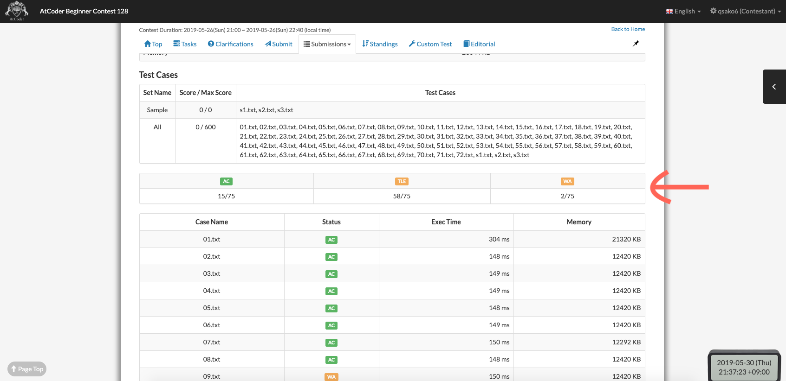

[English](README.md) | [日本語](README.ja.md)

# Userscripts for AtCoder

## atcoder-submission-status
AtCoderで提出した解答がいくつのテストケースでACか, WAか...等が一目でわかるように表示するスクリプトです。

[Install Link](https://greasyfork.org/ja/scripts/383817-atcoder-submission-status)

